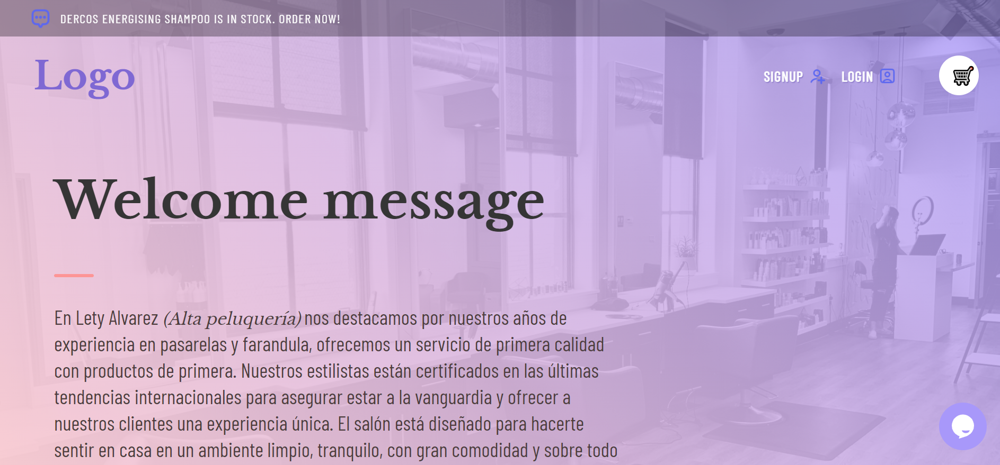

  

  # Ecommerce-Beauty-Salon
  ## Description 
  Web Store Application powered by a MERN stack and designed for a local business in Mexico City that wanted to sell specialized hair products. The store has displays of products, cart, live chat and a payment processor integration.

  ---
  ## Table of Contents
  ---
  * [Installation](##Installation)
  * [Usage](#Usage)
  * [License](#License)  
  * [Badges](#Badges)
  * [FAQ](#Faq)
  * [Contributors](##Contributors)
  ---
  ## Installation
  npm run install && npm run build && npm run develop

  
  ---
  ## Usage 

  ### Landing page
  
  

  ### Products page
  
  

  ### SignUp page
  
  

  ### LogIn page
  
  

  ### Order History page
  
  

  ### Shopping Cart page
  
  

  ### Checkout page
  
  

  ---  
  
  ## License
  The license used for this project: MIT
  
  ---
  
  ## Badges
  
  ---
  ## FAQ
  - **How can I contact you if I have any further questions?**
    - Github

  ## Contributors
  - [ltrevino](https://github.com/ltrevino)
  - [Aaron8907](https://github.com/Aaron8907)
  - [ca2los](https://github.com/ca2los)
  - [ian-dot](https://github.com/ian-dot)
  
  ---
  
